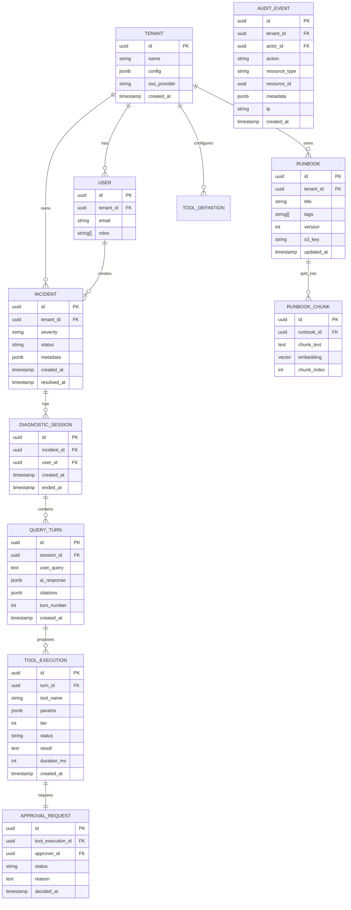

# 04 — Data Model

## Entity Relationship Diagram



---

## DDL Sketches (PostgreSQL + Citus)

### Tenants & Users

```sql
CREATE TABLE tenant (
    id          UUID PRIMARY KEY DEFAULT gen_random_uuid(),
    name        TEXT NOT NULL,
    config      JSONB NOT NULL DEFAULT '{}',
    sso_provider TEXT,
    created_at  TIMESTAMPTZ NOT NULL DEFAULT now()
);

CREATE TABLE "user" (
    id          UUID PRIMARY KEY DEFAULT gen_random_uuid(),
    tenant_id   UUID NOT NULL REFERENCES tenant(id),
    email       TEXT NOT NULL,
    roles       TEXT[] NOT NULL DEFAULT '{}',
    created_at  TIMESTAMPTZ NOT NULL DEFAULT now(),
    UNIQUE (tenant_id, email)
);

-- Citus distribution
SELECT create_distributed_table('user', 'tenant_id');
```

### Incidents

```sql
CREATE TABLE incident (
    id          UUID PRIMARY KEY DEFAULT gen_random_uuid(),
    tenant_id   UUID NOT NULL REFERENCES tenant(id),
    severity    TEXT NOT NULL CHECK (severity IN ('P1','P2','P3','P4','P5')),
    status      TEXT NOT NULL DEFAULT 'open'
                CHECK (status IN ('open','triaging','diagnosing','mitigating','resolved','postmortem')),
    title       TEXT NOT NULL,
    metadata    JSONB NOT NULL DEFAULT '{}',
    created_at  TIMESTAMPTZ NOT NULL DEFAULT now(),
    resolved_at TIMESTAMPTZ,
    deleted_at  TIMESTAMPTZ  -- soft delete
);

CREATE INDEX idx_incident_tenant_status ON incident (tenant_id, status);
CREATE INDEX idx_incident_tenant_severity ON incident (tenant_id, severity);
CREATE INDEX idx_incident_created ON incident (tenant_id, created_at DESC);

SELECT create_distributed_table('incident', 'tenant_id');
```

### Diagnostic Sessions & Query Turns

```sql
CREATE TABLE diagnostic_session (
    id          UUID PRIMARY KEY DEFAULT gen_random_uuid(),
    tenant_id   UUID NOT NULL,  -- denormalized for distribution
    incident_id UUID NOT NULL,
    user_id     UUID NOT NULL,
    created_at  TIMESTAMPTZ NOT NULL DEFAULT now(),
    ended_at    TIMESTAMPTZ
);

CREATE TABLE query_turn (
    id          UUID PRIMARY KEY DEFAULT gen_random_uuid(),
    tenant_id   UUID NOT NULL,
    session_id  UUID NOT NULL,
    user_query  TEXT NOT NULL,
    ai_response JSONB NOT NULL,
    citations   JSONB NOT NULL DEFAULT '[]',
    turn_number INT NOT NULL,
    created_at  TIMESTAMPTZ NOT NULL DEFAULT now()
);

CREATE INDEX idx_turn_session ON query_turn (session_id, turn_number);

SELECT create_distributed_table('diagnostic_session', 'tenant_id');
SELECT create_distributed_table('query_turn', 'tenant_id', colocate_with => 'diagnostic_session');
```

### Tool Executions & Approvals

```sql
CREATE TABLE tool_execution (
    id          UUID PRIMARY KEY DEFAULT gen_random_uuid(),
    tenant_id   UUID NOT NULL,
    turn_id     UUID NOT NULL,
    tool_name   TEXT NOT NULL,
    params      JSONB NOT NULL,
    tier        INT NOT NULL CHECK (tier IN (0, 1, 2)),
    status      TEXT NOT NULL DEFAULT 'pending'
                CHECK (status IN ('pending','approved','executing','completed','failed','rejected','timed_out')),
    result      TEXT,
    duration_ms INT,
    created_at  TIMESTAMPTZ NOT NULL DEFAULT now()
);

CREATE TABLE approval_request (
    id                UUID PRIMARY KEY DEFAULT gen_random_uuid(),
    tenant_id         UUID NOT NULL,
    tool_execution_id UUID NOT NULL REFERENCES tool_execution(id),
    approver_id       UUID,
    status            TEXT NOT NULL DEFAULT 'pending'
                      CHECK (status IN ('pending','approved','rejected','timed_out','escalated')),
    reason            TEXT,
    decided_at        TIMESTAMPTZ
);

SELECT create_distributed_table('tool_execution', 'tenant_id', colocate_with => 'query_turn');
SELECT create_distributed_table('approval_request', 'tenant_id', colocate_with => 'tool_execution');
```

### Runbooks

```sql
CREATE TABLE runbook (
    id          UUID PRIMARY KEY DEFAULT gen_random_uuid(),
    tenant_id   UUID NOT NULL REFERENCES tenant(id),
    title       TEXT NOT NULL,
    tags        TEXT[] NOT NULL DEFAULT '{}',
    team        TEXT,
    version     INT NOT NULL DEFAULT 1,
    s3_key      TEXT NOT NULL,
    created_at  TIMESTAMPTZ NOT NULL DEFAULT now(),
    updated_at  TIMESTAMPTZ NOT NULL DEFAULT now(),
    deleted_at  TIMESTAMPTZ
);

CREATE INDEX idx_runbook_tenant_tags ON runbook USING GIN (tags);

SELECT create_distributed_table('runbook', 'tenant_id');
```

### Audit Events (partitioned)

```sql
CREATE TABLE audit_event (
    id            UUID NOT NULL DEFAULT gen_random_uuid(),
    tenant_id     UUID NOT NULL,
    actor_id      UUID,
    action        TEXT NOT NULL,
    resource_type TEXT NOT NULL,
    resource_id   UUID,
    metadata      JSONB NOT NULL DEFAULT '{}',
    ip            INET,
    user_agent    TEXT,
    created_at    TIMESTAMPTZ NOT NULL DEFAULT now(),
    PRIMARY KEY (id, created_at)
) PARTITION BY RANGE (created_at);

-- Monthly partitions
CREATE TABLE audit_event_2026_05 PARTITION OF audit_event
    FOR VALUES FROM ('2026-05-01') TO ('2026-06-01');
CREATE TABLE audit_event_2026_06 PARTITION OF audit_event
    FOR VALUES FROM ('2026-06-01') TO ('2026-07-01');
-- ... auto-created by pg_partman

CREATE INDEX idx_audit_tenant_resource ON audit_event (tenant_id, resource_type, resource_id);
CREATE INDEX idx_audit_tenant_time ON audit_event (tenant_id, created_at DESC);
```

---

## Vector Store Schema (Qdrant)

Each tenant gets a dedicated collection for isolation:

```json
{
  "collection_name": "runbook_chunks_tn_acme",
  "vectors": {
    "size": 1024,
    "distance": "Cosine"
  },
  "payload_schema": {
    "runbook_id": "keyword",
    "chunk_index": "integer",
    "title": "text",
    "tags": "keyword[]",
    "team": "keyword",
    "version": "integer"
  }
}
```

## Elasticsearch Index (BM25)

One index per tenant, aliased for rollover:

```json
{
  "settings": {
    "number_of_shards": 2,
    "number_of_replicas": 1,
    "analysis": {
      "analyzer": {
        "network_analyzer": {
          "type": "custom",
          "tokenizer": "standard",
          "filter": ["lowercase", "network_synonyms"]
        }
      }
    }
  },
  "mappings": {
    "properties": {
      "chunk_text":  { "type": "text", "analyzer": "network_analyzer" },
      "runbook_id":  { "type": "keyword" },
      "title":       { "type": "text" },
      "tags":        { "type": "keyword" },
      "team":        { "type": "keyword" },
      "chunk_index": { "type": "integer" }
    }
  }
}
```

Network-domain synonym filter handles: `BGP/border gateway protocol`, `OSPF/open shortest path first`, `MTU/maximum transmission unit`, etc.

---

## Partitioning & Distribution Strategy

| Table | Distribution Key | Partitioning | Rationale |
|-------|-----------------|--------------|-----------|
| `incident` | `tenant_id` (Citus) | — | Colocate tenant data on same shard |
| `diagnostic_session` | `tenant_id` | — | Colocated with incident |
| `query_turn` | `tenant_id` | — | Colocated with session for join efficiency |
| `tool_execution` | `tenant_id` | — | Colocated with query_turn |
| `approval_request` | `tenant_id` | — | Colocated with tool_execution |
| `runbook` | `tenant_id` | — | Colocated |
| `audit_event` | — | `RANGE (created_at)` monthly | Time-based queries, partition pruning, easy archival |

### Row-Level Security (defense-in-depth)

```sql
ALTER TABLE incident ENABLE ROW LEVEL SECURITY;

CREATE POLICY tenant_isolation ON incident
    USING (tenant_id = current_setting('app.current_tenant_id')::UUID);
```

Applied to all tenant-scoped tables. The application sets `app.current_tenant_id` per request from the JWT.

---

## Data Lifecycle

| Data | Hot | Warm | Cold | Delete |
|------|-----|------|------|--------|
| Incidents | PG (forever) | — | — | Soft-delete only |
| Query turns | PG (1 year) | S3 Parquet | — | Per tenant retention |
| Tool results | PG (90 days) | S3 | — | Per tenant retention |
| Audit events | ES (30 days) | S3 Parquet | S3 Glacier | 1–7 years (configurable) |
| Runbook chunks | Qdrant + ES | — | — | Deleted on runbook delete |
| Runbook source | S3 (all versions) | — | S3 Glacier (old versions) | Soft-delete only |
