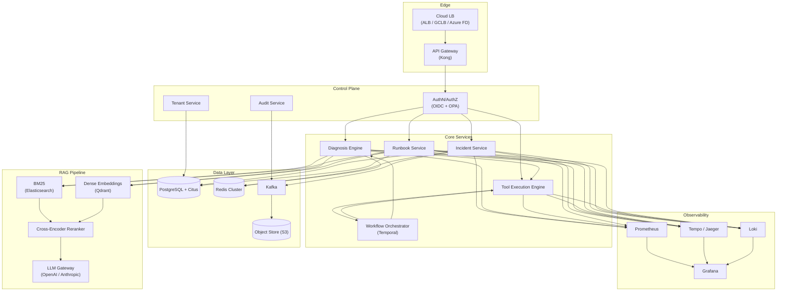

# 05 — High-Level Architecture

## System Overview



---

## Component Inventory

| Layer | Component | Technology | Purpose |
|-------|-----------|------------|---------|
| **Edge** | Load Balancer | ALB / GCLB / Azure Front Door | TLS termination, routing |
| **Edge** | API Gateway | Kong | Rate limiting, auth, request routing |
| **Control** | AuthN/AuthZ | OIDC + OPA sidecar | Identity, fine-grained policy |
| **Control** | Tenant Service | Custom (Go) | Tenant config, provisioning, isolation |
| **Control** | Audit Service | Custom (Go) | Immutable event log, compliance |
| **Core** | Incident Service | Custom (Go) | Incident lifecycle, webhooks |
| **Core** | Diagnosis Engine | Custom (Python) | RAG pipeline, conversational AI |
| **Core** | Tool Execution Engine | Custom (Go) | Sandboxed tool runs, approval gates |
| **Core** | Runbook Service | Custom (Go) | Runbook CRUD, ingestion pipeline |
| **Core** | Workflow Orchestrator | Temporal | Multi-step async workflows |
| **RAG** | BM25 Search | Elasticsearch 8.x | Lexical retrieval |
| **RAG** | Dense Embeddings | Qdrant | Semantic retrieval (bge-large-en-v1.5) |
| **RAG** | Reranker | bge-reranker-v2-m3 | Cross-encoder scoring |
| **RAG** | LLM Gateway | Custom proxy | Model routing, fallback, token budgets |
| **Data** | Primary DB | PostgreSQL + Citus | Structured data, multi-tenant sharding |
| **Data** | Cache | Redis Cluster | Session cache, rate-limit counters |
| **Data** | Object Store | S3 / GCS / Azure Blob | Runbook source, audit archive |
| **Data** | Event Bus | Kafka | Incident events, audit events |
| **Observability** | Metrics | Prometheus | SLI collection |
| **Observability** | Traces | Tempo / Jaeger | Distributed tracing (OpenTelemetry) |
| **Observability** | Logs | Loki | Structured log aggregation |
| **Observability** | Dashboards | Grafana | Visualization, alerting |

---

## End-to-End Request Flow

### Incident Creation → AI Diagnosis → Tool Execution → Resolution

```
 ┌──────────────┐
 │ Alert Source  │  (Grafana / PagerDuty / Opsgenie / ServiceNow)
 └──────┬───────┘
        │ webhook
        ▼
 ┌──────────────┐
 │ API Gateway  │──→ AuthN (verify webhook signature or JWT)
 └──────┬───────┘
        │
        ▼
 ┌──────────────┐
 │  Incident    │  1. Create incident (status=Open)
 │  Service     │  2. Publish to Kafka topic: incidents.lifecycle
 └──────┬───────┘
        │ Kafka event
        ▼
 ┌──────────────┐
 │  Temporal    │  3. Auto-Triage Workflow starts
 │  Workflow    │  4. Enrich: query CMDB + pull metrics (parallel)
 └──────┬───────┘
        │
        ▼
 ┌──────────────┐
 │  SRE opens   │  5. POST /incidents/{id}/sessions
 │  session     │  6. POST /sessions/{id}/query
 └──────┬───────┘
        │
        ▼
 ┌─────────────────────────────────────────────────────────┐
 │                  Diagnosis Engine                        │
 │                                                         │
 │  a. LLM rewrites SRE query → 3 retrieval queries       │
 │  b. BM25 search (Elasticsearch) → top 50               │
 │  c. Dense search (Qdrant) → top 50                     │
 │  d. Reciprocal Rank Fusion → 80 unique candidates      │
 │  e. Cross-encoder reranker → top 10                    │
 │  f. Assemble context (chunks + incident + history)     │
 │  g. LLM generates structured response                  │
 └──────┬──────────────────────────────────────────────────┘
        │ SSE stream
        ▼
 ┌──────────────┐
 │  SRE sees    │  7. Diagnosis + evidence + proposed tools
 │  response    │
 └──────┬───────┘
        │ Tier-0 auto-approved / Tier-1+ needs approval
        ▼
 ┌──────────────┐
 │  Tool Exec   │  8. Run in gVisor sandbox (30s timeout)
 │  Engine      │  9. Return output to Diagnosis Engine
 └──────┬───────┘
        │
        ▼
 ┌──────────────┐
 │  Diagnosis   │  10. Re-run generation with tool results
 │  Engine      │      → updated diagnosis (confidence ↑)
 └──────┬───────┘
        │ repeat steps 6–10 as needed
        ▼
 ┌──────────────┐
 │  SRE confirms│  11. PATCH /incidents/{id} → status=Mitigating
 │  root cause  │  12. PATCH /incidents/{id} → status=Resolved
 └──────┬───────┘
        │
        ▼
 ┌──────────────┐
 │  Temporal    │  13. Generate postmortem draft from session transcript
 │  Workflow    │  14. All events written to audit log
 └──────────────┘
```

### Latency Breakdown (p50 target: <3s)

| Step | Latency | Notes |
|------|---------|-------|
| Gateway + Auth | ~20 ms | JWT validation + OPA check |
| Query rewriting | ~300 ms | Small LLM call |
| BM25 search (ES) | ~50 ms | Parallel with dense search |
| Dense search (Qdrant) | ~80 ms | Parallel with BM25 |
| RRF merge | ~5 ms | In-memory |
| Cross-encoder rerank | ~200 ms | GPU inference, 80 candidates |
| Context assembly | ~10 ms | In-memory |
| LLM generation | ~2,000 ms | Time to first token (streaming) |
| **Total (p50)** | **~2,665 ms** | Under 3s target |

### Communication Patterns

| From → To | Protocol | Pattern |
|-----------|----------|---------|
| Client → Gateway | HTTPS | Request-response / SSE |
| Gateway → Services | gRPC | Unary / server-streaming |
| Services → Services | gRPC | Unary |
| Services → Kafka | TCP | Async produce |
| Kafka → Services | TCP | Async consume |
| Services → PG | TCP | Connection pool (PgBouncer) |
| Services → ES/Qdrant | HTTP | Request-response |
| Services → Redis | TCP | Connection pool |
| Services → LLM API | HTTPS | Streaming |
| Temporal → Activities | gRPC | Workflow dispatch |
