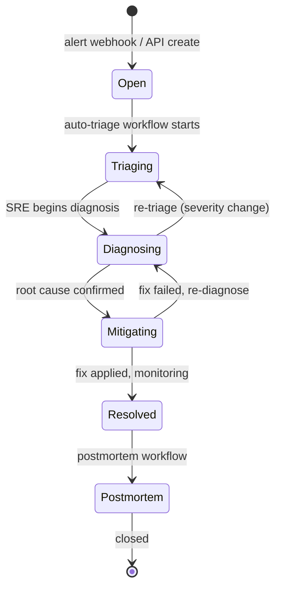
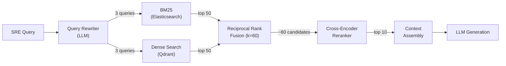
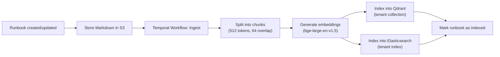

# 06 — Detailed Components

## 1. API Gateway & AuthN/AuthZ

### API Gateway (Kong)

**Plugins enabled:**
- `rate-limiting` — per-tenant token-bucket. Limits in 01-requirements.
- `request-size-limiting` — 1 MB max body (runbook uploads go to presigned S3 URL).
- `ip-restriction` — optional per-tenant IP allowlist.
- `correlation-id` — injects `X-Request-Id` for distributed tracing.
- `opentelemetry` — exports spans to Tempo.

**Routing:**
- `/api/v1/incidents/**` → Incident Service
- `/api/v1/sessions/**` → Diagnosis Engine
- `/api/v1/tool-executions/**` → Tool Execution Engine
- `/api/v1/runbooks/**` → Runbook Service
- `/api/v1/audit/**` → Audit Service

### AuthN (OIDC)

Each tenant configures their IdP (Okta, Azure AD, Google Workspace). Kong validates JWT:

```
JWT Claims:
{
  "sub": "usr_jane",
  "tenant_id": "tn_acme",
  "roles": ["sre", "tool_approver"],
  "exp": 1717459200
}
```

### AuthZ (OPA)

OPA sidecar on every service pod. Policies in Rego:

```rego
package netdiag.authz

default allow = false

# SREs can submit diagnostic queries
allow {
    input.action == "session.query"
    "sre" == input.user.roles[_]
}

# Only tool_approver role can approve Tier-1+ executions
allow {
    input.action == "tool_execution.approve"
    input.resource.tier >= 1
    "tool_approver" == input.user.roles[_]
}

# Tier-2 requires dual approval (different approver than proposer)
allow {
    input.action == "tool_execution.approve"
    input.resource.tier == 2
    input.user.id != input.resource.proposed_by
}
```

---

## 2. Tenant Service

**Responsibilities:**
- CRUD for tenant configuration.
- Provisions per-tenant resources on creation:
  - PostgreSQL schema (Citus distributed tables)
  - Qdrant collection (`runbook_chunks_tn_{id}`)
  - Elasticsearch index (`runbooks_tn_{id}`)
  - Kafka topic partitions (or dedicated topics for large tenants)
- Tenant config schema:

```json
{
  "llm_model_override": null,
  "allowed_tools": ["ping", "traceroute", "show_bgp_neighbor", "show_interface_mtu"],
  "approval_policy": {
    "tier_0_auto_approve": true,
    "tier_1_approvers": ["role:tool_approver"],
    "tier_2_approvers": ["role:tool_approver"],
    "tier_2_require_dual": true,
    "approval_timeout_min": 5,
    "escalation_timeout_min": 15
  },
  "sso": { "provider": "okta", "issuer_url": "https://acme.okta.com" },
  "data_retention_days": 365,
  "max_concurrent_tool_executions": 5,
  "token_budget_monthly": 50000000
}
```

**Isolation enforcement:** Every service middleware extracts `tenant_id` from JWT and sets `app.current_tenant_id` on the PG connection + passes it in gRPC metadata. RLS policies guarantee no cross-tenant data leakage even if application code has bugs.

---

## 3. Incident Service

### State Machine



### Webhook Normalization

Each provider adapter normalizes to the internal incident schema:

```
PagerDuty event → {severity: map(urgency), title: event.summary, metadata: {pd_incident_id, service}}
Alertmanager  → {severity: map(labels.severity), title: annotations.summary, metadata: {alertname, labels}}
```

### Events Published

On every status transition, publishes to Kafka `incidents.lifecycle`:
```json
{
  "event": "incident.status_changed",
  "incident_id": "inc_01HYX3...",
  "tenant_id": "tn_acme",
  "old_status": "open",
  "new_status": "triaging",
  "timestamp": "2026-05-03T22:00:01Z"
}
```

Consumed by: Temporal (workflow triggers), Audit Service, Diagnosis Engine (context enrichment).

---

## 4. Diagnosis Engine (RAG Pipeline)

The most complex component. Handles the AI-powered diagnostic conversation.

### Retrieval Pipeline



**Query rewriter:** Uses a small, fast LLM call to expand the SRE's question into retrieval-optimized variants. Example:
- Input: "BGP session to 10.0.1.1 flapping every 90s"
- Output queries:
  1. `BGP session flapping hold timer expired` (lexical)
  2. `troubleshoot BGP neighbor instability periodic drops` (semantic)
  3. `10.0.1.1 BGP peer state oscillating` (entity-specific)

**BM25 leg (Elasticsearch):**
- Custom `network_analyzer` with synonym filter (BGP ↔ "border gateway protocol", MTU ↔ "maximum transmission unit").
- Searches `runbook_chunks` + `past_incident_summaries` indices.
- Returns top-50 by BM25 score.

**Dense embedding leg (Qdrant):**
- `bge-large-en-v1.5` model, 1024 dimensions, cosine similarity.
- Searches tenant-scoped collection.
- Returns top-50 by vector similarity.

**Reciprocal Rank Fusion:**
- Merges BM25 and dense results. Score: `1 / (k + rank_bm25) + 1 / (k + rank_dense)` with k=60.
- Deduplicates by chunk ID. Typically yields ~80 unique candidates.

**Cross-encoder reranker:**
- `bge-reranker-v2-m3` scores each (query, candidate) pair.
- GPU-accelerated, batched inference. ~200ms for 80 candidates.
- Top-10 pass to generation.

### Generation

Context window structure:
```
<system>
You are a network incident diagnosis assistant. Output structured JSON:
{diagnosis, confidence, evidence[], proposed_tools[], follow_up_questions[]}
</system>

<incident>
ID: inc_01HYX3, Severity: P1, Status: diagnosing
Devices: cr01.sjc, Interfaces: et-0/0/1
</incident>

<runbook_context>
[1] BGP Troubleshooting v3, chunk 7: "When hold timer expires repeatedly..."
[2] Transit Link Runbook, chunk 3: "MTU issues on transit links cause..."
... (top 10 chunks with source attribution)
</runbook_context>

<tool_results>
show_bgp_neighbor cr01.sjc 10.0.1.1: "State: Active, Hold time: 90s..."
</tool_results>

<conversation>
Turn 1 - User: "BGP session to 10.0.1.1 is flapping every 90s..."
Turn 1 - AI: {previous response}
Turn 2 - User: "What about the MTU on that link?"
</conversation>
```

### Model Routing

```
if incident.severity in (P1, P2):
    model = tenant.config.llm_model_override or "claude-sonnet"
elif incident.severity in (P3, P4, P5):
    model = "claude-haiku"
```

---

## 5. Tool Execution Engine

### Tool Registry

Tools are defined as declarative specs stored per tenant:

```json
{
  "name": "show_bgp_neighbor",
  "display_name": "Show BGP Neighbor",
  "tier": 0,
  "timeout_seconds": 30,
  "container_image": "netdiag/tools/junos-cli:1.2",
  "command_template": "show bgp neighbor {{peer}}",
  "params_schema": {
    "device": {"type": "string", "required": true},
    "peer": {"type": "string", "format": "ipv4", "required": true}
  },
  "network_access": "device_only"
}
```

### Execution Sandbox

```mermaid
flowchart TD
    A["AI proposes tool call"] --> B{"Tier?"}
    B -->|"Tier 0"| C["Auto-approve"]
    B -->|"Tier 1"| D["Single approval gate"]
    B -->|"Tier 2"| E["Dual approval gate"]
    C --> F["Spawn ephemeral container"]
    D -->|"Approved"| F
    E -->|"Both approved"| F
    D -->|"Rejected/Timeout"| G["Skip, continue diagnosis"]
    E -->|"Rejected/Timeout"| G
    F --> H["gVisor sandbox"]
    H --> I{"Network policy"}
    I --> J["Execute against device"]
    J --> K{"Success?"}
    K -->|"Yes"| L["Return result to Diagnosis Engine"]
    K -->|"Timeout/Error"| M["Mark FAILED, notify AI"]
```



**Security layers:**
1. **Container isolation:** gVisor (user-space kernel) — no direct host syscalls.
2. **Network policy:** Calico GlobalNetworkPolicy restricts egress to target device IP only.
3. **Credential injection:** HashiCorp Vault sidecar. Credentials mounted as tmpfs, never in env vars or container image.
4. **Timeout enforcement:** 30s soft timeout (SIGTERM), 60s hard timeout (SIGKILL).
5. **Output sanitization:** Credential patterns stripped before returning to AI.

### Approval Gate

- **Notification channels:** Slack (via webhook), UI push (WebSocket), PagerDuty (for Tier-2).
- **Timeout cascade:** 5 min → escalate to team lead → 15 min → auto-reject.
- **Audit:** Every approval/rejection/timeout logged with actor, reason, timestamp.

---

## 6. Runbook Service

### Ingestion Pipeline



**Chunking strategy:**
- 512-token chunks with 64-token overlap to preserve context across boundaries.
- Section-aware splitting: prefers breaking at Markdown headers (`##`, `###`) when possible.
- Each chunk retains metadata: runbook_id, title, tags, chunk_index.

### Git-Sync Mode

- Tenant configures a Git repo URL + branch + deploy key.
- Polling interval: 5 min (configurable).
- On new commits: diff changed `.md` files, re-ingest only changed runbooks.
- Runs as a Temporal cron workflow for durability.

---

## 7. Workflow Orchestrator (Temporal)

### Workflow Types

| Workflow | Trigger | Steps |
|----------|---------|-------|
| **Auto-Triage** | Incident created | Enrich → initial diagnosis → Tier-0 tools → summarize |
| **Guided Diagnosis** | SRE starts session | Loop: query → tools → re-diagnose until confident |
| **Runbook Ingestion** | Runbook created/updated | Chunk → embed → index ES → index Qdrant |
| **Git-Sync** | Cron (5 min) | Pull repo → diff → re-ingest changed files |
| **Postmortem Generation** | Incident resolved | Collect transcript → LLM summarize → attach to incident |
| **Audit Archival** | Cron (daily) | Query ES hot → write S3 Parquet → hash chain |

### Auto-Triage Workflow (detailed)

```python
@workflow.defn
class AutoTriageWorkflow:
    @workflow.run
    async def run(self, incident_id: str):
        # 1. Enrich incident
        topology = await workflow.execute_activity(
            query_cmdb, args=[incident_id], start_to_close_timeout=timedelta(seconds=10))
        metrics = await workflow.execute_activity(
            pull_recent_metrics, args=[incident_id], start_to_close_timeout=timedelta(seconds=15))

        # 2. Initial diagnosis
        diagnosis = await workflow.execute_activity(
            run_diagnosis_query, args=[incident_id, topology, metrics],
            start_to_close_timeout=timedelta(seconds=30))

        # 3. Auto-execute Tier-0 tools
        for tool in diagnosis.proposed_tools:
            if tool.tier == 0:
                result = await workflow.execute_activity(
                    execute_tool, args=[tool],
                    start_to_close_timeout=timedelta(seconds=45))
                diagnosis = await workflow.execute_activity(
                    refine_diagnosis, args=[incident_id, result],
                    start_to_close_timeout=timedelta(seconds=30))

        # 4. Iterate until confident or max attempts
        for _ in range(4):  # max 5 total iterations
            if diagnosis.confidence > 0.8:
                break
            # ... request Tier-1 approval, wait, re-diagnose

        # 5. Attach summary to incident
        await workflow.execute_activity(
            attach_triage_summary, args=[incident_id, diagnosis])
```

**Properties:**
- Activities have individual retries with exponential backoff (max 3 retries).
- Saga compensation: if mid-workflow failure, clean up partial tool executions.
- Workflow timeout: 30 min (prevents runaway workflows).

---

## 8. Audit Service

### Event Schema

```json
{
  "id": "evt_a1b2c3",
  "tenant_id": "tn_acme",
  "actor_id": "usr_jane",
  "action": "tool_execution.approve",
  "resource_type": "tool_execution",
  "resource_id": "texec_9f...",
  "metadata": {
    "tier": 1,
    "tool": "packet_capture",
    "params": {"device": "cr01.sjc", "duration": "30s"}
  },
  "ip": "10.20.30.40",
  "user_agent": "NetDiag-UI/2.1",
  "created_at": "2026-05-03T22:05:00Z"
}
```

### Storage Tiers

```
Real-time: Kafka topic (audit.events) — 7 day retention
Hot:       Elasticsearch — 30 days, queryable via API
Warm:      S3 Parquet (partitioned by tenant/date) — 1 year
Cold:      S3 Glacier — up to 7 years (per tenant config)
```

### Tamper Detection

Daily batch job computes SHA-256 hash chain:
```
hash_day_N = SHA256(hash_day_N-1 || SHA256(all_events_day_N))
```
Hash chain anchored in an immutable ledger (or simply stored in a separate, append-only table with restricted access). Any retroactive modification of audit data breaks the chain.

---

## 9. Safety Controls

### Blast Radius Limits

| Control | Default | Configurable |
|---------|---------|-------------|
| Max concurrent tool executions per tenant | 5 | Yes |
| Max mutating actions per incident | 3 | Yes |
| Max LLM queries per session | 20 | Yes |
| Max tool execution timeout | 60s | Yes (per tool) |

### Kill Switch

```
POST /api/v1/admin/tenants/{id}/kill-switch
Authorization: Bearer <platform_admin_jwt>
{"action": "halt_all_tool_executions"}
```

Immediately:
1. Sets tenant flag in Redis (checked by Tool Execution Engine on every execution attempt).
2. Cancels all in-flight tool execution containers.
3. Publishes kill event to Kafka for audit.
4. Does NOT affect read-only diagnosis queries — only tool execution.

### PII Detection

Presidio-based scanner runs on:
- SRE query input (before sending to LLM)
- LLM output (before returning to client)
- Tool execution output (before logging)

Detects and redacts: email addresses, SSNs, API keys, credit card numbers. Configurable entity types per tenant.

### Prompt Injection Defense

1. **Input sanitization:** Strip control characters, limit query length (2000 chars).
2. **Structured output enforcement:** LLM output must parse as valid JSON matching the response schema. Invalid output → retry once → return error.
3. **Canary tokens:** System prompt includes unique per-request canary. If canary appears in output, the prompt has been leaked → reject response, alert security.
4. **Separation:** User content wrapped in `<context>` tags. System instructions never concatenated with user input without clear delimiters.
