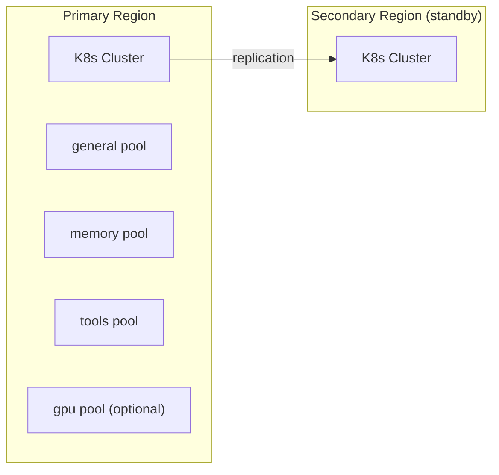

# 08 — Scaling Strategy

## Scaling Goals

- Support **500+ enterprise tenants** with strict isolation.
- Keep diagnostic query latency at **p50 < 3s** and **p99 < 8s**.
- Handle incident storms (5–10x normal traffic) without cross-tenant impact.
- Scale uniformly across **EKS, GKE, and AKS**.

## 1) Compute Scaling

### Stateless Services + Horizontal Pod Autoscaling

All API/control/core services are stateless; state is externalized to PostgreSQL, Redis, Kafka, Elasticsearch, and Qdrant.

Autoscaling policy:
- **HPA signals:** CPU + custom metrics (RPS, queue depth, in-flight requests).
- **Pod disruption budgets:** maintain minimum availability during upgrades.
- **Priority classes:** P1/P2 diagnosis workloads get higher scheduling priority.

| Service | Primary Scaling Signal | Typical Concurrency / Pod |
|---------|------------------------|---------------------------|
| API Gateway | RPS + p95 latency | 2k req/s |
| Incident Service | write/read RPS | 200 req/s |
| Diagnosis Engine | in-flight queries | ~10 active queries |
| Tool Execution Engine | pending tool queue depth | ~20 running tasks |
| Runbook Service | ingestion queue depth | ~10 workflows |

### Tenant Fairness

- Per-tenant request quotas at gateway.
- Weighted fair queuing for LLM requests.
- Dedicated worker pools for high-paying or regulated tenants.
- Backpressure: when queue depth exceeds threshold, return `429` with retry hints.

## 2) Data Scaling

### PostgreSQL + Citus

- Distribute tenant-scoped tables by `tenant_id`.
- Add Citus workers as tenant count grows.
- Read replicas for heavy query workloads (audit and reporting).
- PgBouncer in transaction pooling mode to cap connection overhead.

### Elasticsearch (BM25)

- Hot/warm/cold tiers using ILM:
  - Hot (SSD, 7 days)
  - Warm (30 days)
  - Cold (object-backed)
- Shard by tenant or tenant-group to reduce noisy-neighbor impact.
- Query cache + segment merge tuning for predictable p95 latency.

### Qdrant (Embeddings)

- Sharded collections with replication (`rf=2` or `rf=3`).
- One collection per tenant for isolation and blast-radius control.
- Background compaction + snapshot backup to object storage.

### Kafka

- Partition key: `tenant_id` to preserve ordering within tenant streams.
- Increase partitions as consumer lag rises.
- Replication factor 3, `acks=all`, idempotent producers enabled.

### Redis

- Cluster mode for horizontal scaling.
- Used for:
  - Session context cache
  - rate-limit counters
  - kill-switch flags
- Eviction policy: `allkeys-lru`.

## 3) LLM Scaling

### Multi-Provider Routing

- Primary provider for quality (e.g., Claude Sonnet / GPT-4o).
- Fallback provider for resilience.
- Optional self-hosted vLLM for bounded-latency internal paths.

### Priority & Cost Controls

- Priority queue: `P1 > P2 > P3 > P4/P5`.
- Token budgets per tenant (monthly hard limit + soft warning threshold).
- Model downgrade policy for non-critical incidents under load.

### Caching & Context Optimization

- Cache rewritten retrieval queries for repeated turn patterns.
- Cache top-k retrieval results for short windows (e.g., 60s).
- Trim conversation window to last N turns + summary to bound token growth.

## 4) Kubernetes Deployment (EKS/GKE/AKS)

### Node Pools

- **general:** API + control services
- **memory:** Elasticsearch + Qdrant
- **tools:** sandboxed tool execution pods (gVisor runtime class)
- **gpu (optional):** reranker/LLM inference acceleration

### Portability Layer

- Helm charts + Kustomize overlays for cloud-specific settings.
- External Secrets Operator for AWS/GCP/Azure secret managers.
- Ingress abstraction:
  - EKS: ALB ingress controller
  - GKE: GCLB ingress
  - AKS: AGIC / NGINX ingress

## 5) Multi-Region Strategy

- **Active-passive** by default for operational simplicity.
- Cross-region replication:
  - PostgreSQL streaming replication
  - ES/Qdrant snapshot replication
  - S3/GCS/Blob cross-region replication
- DNS failover with health checks (TTL ~60s).
- Target: **RTO < 5 minutes**, **RPO < 1 minute** for critical metadata.

## 6) Capacity Planning Triggers

Scale-out triggers:
- Query latency p95 > threshold for 10 min.
- Kafka consumer lag > 10k.
- Qdrant p99 > 500ms.
- HPA at max replicas for >15 min.
- CPU > 70% and memory > 75% sustained.

Scale-in safeguards:
- Cooldown windows (10–15 min).
- Minimum replicas per critical service.
- Never scale in during active incident storms (gated by incident count).

## 7) Load Testing Strategy

- k6 scenarios:
  - Baseline steady load
  - 5x storm burst
  - tenant-skewed noisy-neighbor simulation
- Replay anonymized production traces for realism.
- Pass criteria:
  - p99 query latency < 8s
  - no cross-tenant starvation
  - <1% tool timeout under baseline
